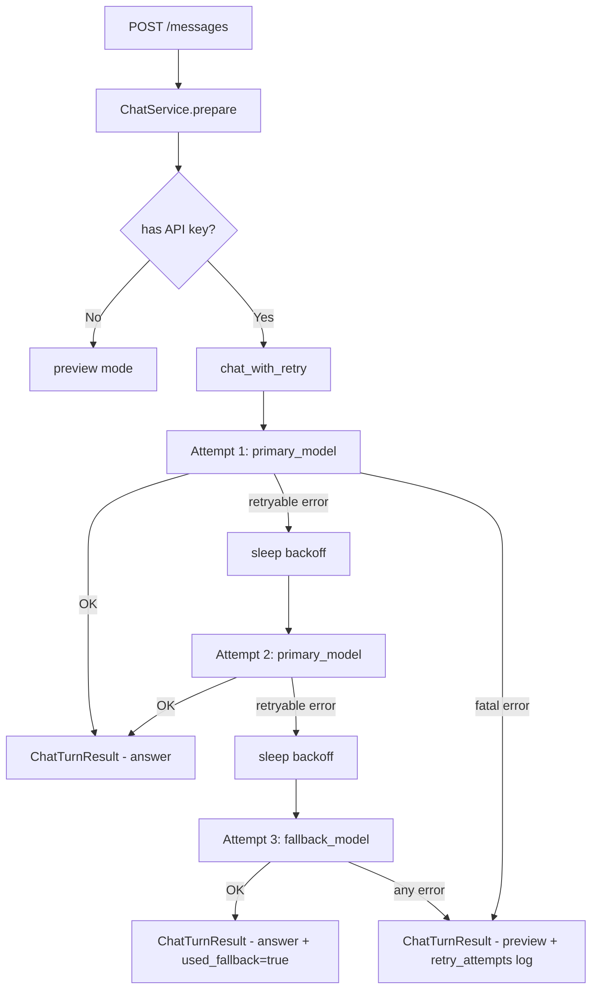

# Kế hoạch: Thêm Retry & Fallback cho Chatbot Xanh SM

## Bối cảnh & Phân tích hiện trạng

Hệ thống hiện tại (sau khi đọc kỹ code) có kiến trúc 3 tầng rõ ràng:

```
routes.py (HTTP layer)
  └── ChatService.process() / prepare()
        └── chat_openai_with_metrics() / chat_openai_stream_async()
              └── openai.ChatCompletion.create()
```

### Điểm yếu hiện tại

| Vị trí | Vấn đề |
|--------|--------|
| `chat_service.py` L103–125 | Khi LLM lỗi → **ngay lập tức** trả `preview` mode, không retry |
| `llm.py` L110 | `client.chat.completions.create()` gọi thẳng, không có retry logic |
| `routes.py` L283–285 (stream) | Khi stream lỗi → yield `error` event và return luôn |
| `role_llm.py` L62–69 | Fallback về rule đã có, nhưng không retry LLM trước |
| `settings.py` | Không có config cho `LLM_RETRY_MAX`, `LLM_FALLBACK_MODEL` |

### Hai loại lỗi cần xử lý
1. **Transient errors** (nên retry): `RateLimitError`, `APITimeoutError`, `APIConnectionError`, `InternalServerError` (5xx)
2. **Fatal errors** (không retry): `AuthenticationError`, `PermissionDeniedError`, `BadRequestError` (context quá dài), `NotFoundError`

---

## Thiết kế Retry & Fallback

### Chiến lược tổng thể

```
Lần 1: Gọi model chính (vd: gpt-4o-mini) với timeout=30s
  ├── Thành công → trả kết quả
  └── Lỗi transient
        Lần 2 (sau 1s): Retry cùng model
          ├── Thành công → trả kết quả
          └── Lỗi transient
                Lần 3 (sau 2s): Retry với fallback model (vd: gpt-4.1-nano)
                  ├── Thành công → trả kết quả + note "used_fallback_model"
                  └── Lỗi → trả preview mode + ghi log đầy đủ
```

### Exponential backoff với jitter
- Delay = `base_delay * (2 ** attempt) + random(0, 0.5)`
- Attempt 1 → ~1s, Attempt 2 → ~2s

---

## Proposed Changes

### Component 1: Settings — Thêm config mới

#### [MODIFY] [settings.py](file:///c:/Users/admin/VINUNI/AI20K001-TruongMinhPhuoc-Day05/Nhom64_403/app/settings.py)

Thêm 4 field mới vào `Settings`:

```python
llm_retry_max: int = 2          # số lần retry (sau lần gọi đầu tiên)
llm_retry_base_delay: float = 1.0  # giây, base delay cho exponential backoff
llm_fallback_model: str | None = None  # None = dùng chính model gốc khi retry
llm_timeout: float = 30.0       # timeout tính bằng giây cho mỗi request
```

Biến env tương ứng: `LLM_RETRY_MAX`, `LLM_RETRY_BASE_DELAY`, `LLM_FALLBACK_MODEL`, `LLM_TIMEOUT`.

---

### Component 2: LLM Layer — Retry Engine

#### [NEW] [app/llm_retry.py](file:///c:/Users/admin/VINUNI/AI20K001-TruongMinhPhuoc-Day05/Nhom64_403/app/llm_retry.py)

Module mới chứa toàn bộ logic retry/fallback, **tách biệt hoàn toàn** khỏi logic gọi LLM để dễ test.

```python
# Phân loại lỗi
def is_retryable(exc: Exception) -> bool:
    """True nếu là RateLimitError, APITimeoutError, APIConnectionError, 
       InternalServerError (status >= 500)"""

# Thông tin về 1 lần retry
@dataclass
class RetryAttempt:
    attempt: int          # 0-indexed
    model_used: str
    error: str | None
    delay_before: float   # giây đã chờ

# Kết quả chung sau khi retry xong
@dataclass
class LLMCallResult:
    result: ChatResult | None
    attempts: list[RetryAttempt]
    used_fallback: bool
    final_error: str | None

# Hàm chính
def chat_with_retry(
    system: str,
    user: str,
    *,
    primary_model: str,
    fallback_model: str | None = None,
    max_retries: int = 2,
    base_delay: float = 1.0,
    timeout: float = 30.0,
) -> LLMCallResult:
    ...
```

**Logic cụ thể:**
1. Gọi lần 1 với `primary_model`, timeout = `timeout`
2. Nếu lỗi `is_retryable` → sleep exponential backoff → retry
3. Sau `max_retries` lần thất bại với `primary_model` → chuyển sang `fallback_model`
4. Nếu fallback cũng lỗi → trả `LLMCallResult(result=None, final_error=...)`
5. Nếu lỗi **không** là retryable → break ngay, không thử lại

#### [MODIFY] [llm.py](file:///c:/Users/admin/VINUNI/AI20K001-TruongMinhPhuoc-Day05/Nhom64_403/app/llm.py)

- Thêm `timeout` parameter vào `chat_openai_with_metrics()` và truyền vào `client.chat.completions.create(timeout=timeout)`
- Không thay đổi gì khác để giữ backward compatibility

---

### Component 3: ChatService — Dùng retry engine

#### [MODIFY] [chat_service.py](file:///c:/Users/admin/VINUNI/AI20K001-TruongMinhPhuoc-Day05/Nhom64_403/app/services/chat_service.py)

Thay block `try/except` hiện tại ở `process()`:

**Trước:**
```python
try:
    answer: ChatResult = chat_openai_with_metrics(...)
except Exception as exc:
    # → preview ngay
```

**Sau:**
```python
from ..llm_retry import chat_with_retry

llm_result = chat_with_retry(
    prepared.prompt.system,
    prepared.prompt.user,
    primary_model=prepared.active_model,
    fallback_model=self.settings.llm_fallback_model,
    max_retries=self.settings.llm_retry_max,
    base_delay=self.settings.llm_retry_base_delay,
    timeout=self.settings.llm_timeout,
)

if llm_result.result is None:
    # Tất cả retry đều thất bại
    return ChatTurnResult(
        ..., 
        mode="preview",
        note=f"LLM failed after {len(llm_result.attempts)} attempts: {llm_result.final_error}",
        retry_attempts=llm_result.attempts,  # thêm field mới
    )

# Thành công (có thể đã dùng fallback model)
note = "used_fallback_model" if llm_result.used_fallback else None
return ChatTurnResult(..., answer=llm_result.result, note=note)
```

---

### Component 4: Types — Thêm retry metadata

#### [MODIFY] [types.py](file:///c:/Users/admin/VINUNI/AI20K001-TruongMinhPhuoc-Day05/Nhom64_403/app/services/types.py)

Thêm field `retry_attempts` vào `ChatTurnResult`:

```python
from ..llm_retry import RetryAttempt

@dataclass(frozen=True, slots=True)
class ChatTurnResult:
    ...
    retry_attempts: tuple[RetryAttempt, ...] = field(default_factory=tuple)
    used_fallback_model: bool = False
```

---

### Component 5: Fallback cho role_llm.py (LLM Role Classifier)

#### [MODIFY] [role_llm.py](file:///c:/Users/admin/VINUNI/AI20K001-TruongMinhPhuoc-Day05/Nhom64_403/app/role_llm.py)

Hiện tại đã có fallback về rule-based khi LLM lỗi ✅. Cần cải thiện:

- Thêm **1 retry** trước khi fallback (thay vì fallback ngay khi exception đầu tiên)
- Dùng `chat_with_retry` với `max_retries=1` và `timeout` ngắn hơn (10s) để không làm chậm toàn bộ request

---

### Component 6: SSE Stream Route — Retry trong stream

#### [MODIFY] [routes.py](file:///c:/Users/admin/VINUNI/AI20K001-TruongMinhPhuoc-Day05/Nhom64_403/app/api/routes.py)

Trong `event_stream()` của `post_message_stream`:

**Trước:**
```python
except Exception as exc:
    yield _sse({"type": "error", "message": str(exc)})
    return
```

**Sau:**
- Với stream, retry toàn bộ stream call (không retry từng chunk)
- Nếu stream lỗi → yield `{"type": "retry", "attempt": n}` để frontend biết
- Sau khi vượt max retry → yield `{"type": "error", "message": str(exc), "attempts": n}`

> [!NOTE]
> Stream retry phức tạp hơn vì cần reset collected chunks. Implement bằng vòng lặp retry bao ngoài `async for` block.

---

### Component 7: API Response — Expose retry info (tùy chọn)

#### [MODIFY] [schemas.py](file:///c:/Users/admin/VINUNI/AI20K001-TruongMinhPhuoc-Day05/Nhom64_403/app/api/schemas.py)

Thêm field `retry_info` vào `MessageResponse` (chỉ xuất hiện khi `ENABLE_DEBUG_FIELDS=true`):

```python
class RetryInfoResponse(BaseModel):
    attempts: int
    used_fallback_model: bool
    final_model_used: str

class MessageResponse(BaseModel):
    ...
    retry_info: RetryInfoResponse | None = None  # None nếu không có retry
```

---

## Sơ đồ luồng xử lý



---

## File thay đổi tổng kết

| File | Loại | Mô tả |
|------|------|-------|
| `app/llm_retry.py` | **[NEW]** | Core retry engine: `is_retryable`, `chat_with_retry`, `RetryAttempt`, `LLMCallResult` |
| `app/settings.py` | [MODIFY] | Thêm 4 config: `llm_retry_max`, `llm_retry_base_delay`, `llm_fallback_model`, `llm_timeout` |
| `app/llm.py` | [MODIFY] | Thêm `timeout` param vào `chat_openai_with_metrics` |
| `app/services/chat_service.py` | [MODIFY] | Dùng `chat_with_retry` thay cho `chat_openai_with_metrics` trực tiếp |
| `app/services/types.py` | [MODIFY] | Thêm `retry_attempts`, `used_fallback_model` vào `ChatTurnResult` |
| `app/role_llm.py` | [MODIFY] | Retry 1 lần trước khi fallback về rule-based |
| `app/api/routes.py` | [MODIFY] | SSE stream: retry toàn bộ stream call, yield retry event |
| `app/api/schemas.py` | [MODIFY] | Thêm `retry_info` vào `MessageResponse` |

---

## Open Questions

> [!IMPORTANT]
> **Fallback model là model gì?** Gợi ý: `gpt-4.1-nano` (rẻ nhất, nhanh nhất) làm fallback. Bạn có muốn dùng model khác không?

> [!IMPORTANT]
> **Retry cho stream có cần không?** Stream retry phức tạp hơn nhiều (phải discard collected chunks, reset generator). Nếu không cần thì chỉ cần retry cho non-stream route là đủ.

> [!NOTE]
> **Expose retry_info trong response?** Có thể ẩn sau `ENABLE_DEBUG_FIELDS=true` để production không bị lộ internal info.

---

## Verification Plan

### Automated Tests
- Unit test `is_retryable()` với các loại exception khác nhau
- Unit test `chat_with_retry()` với mock OpenAI client:
  - Thành công lần 1 → không retry
  - Lỗi transient × 2 → retry, thành công lần 3 → `used_fallback=True`
  - Fatal error lần 1 → không retry, trả `preview`
  - Tất cả đều lỗi → `preview` với `retry_attempts` đầy đủ
- Integration test `chat_service.process()` với mock `chat_with_retry`

### Manual Verification
- Set `OPENAI_API_KEY=invalid` → kiểm tra fallback về preview
- Dùng mock để giả lập `RateLimitError` → kiểm tra delay và retry
- Xem log `retry_attempts` trong response khi `ENABLE_DEBUG_FIELDS=true`
